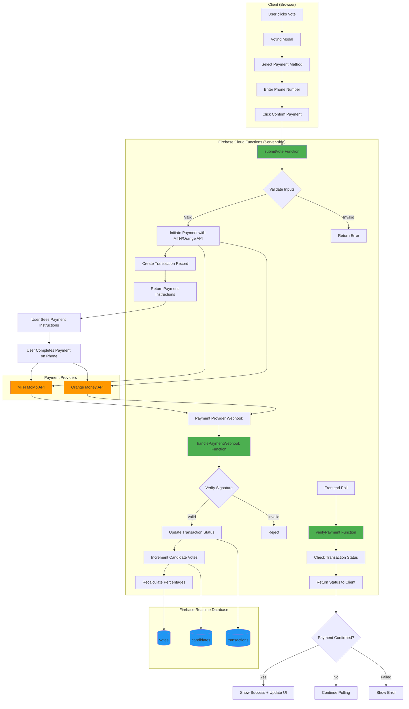

# Firebase Cloud Functions Architecture for Voting System

## Architecture Overview



## Why Firebase Cloud Functions?

### 🔒 Security Benefits

1. **API Keys Never Exposed**
   - Payment provider credentials stored server-side only
   - Client code never sees sensitive data
   - Environment variables encrypted by Firebase

2. **Server-side Validation**
   - All validation happens on Google's servers
   - Client can't bypass security checks
   - Prevents vote manipulation

3. **Database Security**
   - Only Cloud Functions can write to database
   - Client has read-only access
   - Prevents unauthorized vote updates

### ⚡ Performance Benefits

1. **Automatic Scaling**
   - Firebase scales functions automatically
   - Handles traffic spikes during voting periods
   - Pay only for actual usage

2. **Low Latency**
   - Functions run in Google's data centers
   - Can deploy to region closest to Cameroon
   - Fast response times

### 💰 Cost Efficiency

**Free Tier Includes:**

- 2M function invocations/month
- 400,000 GB-seconds of compute time
- 200,000 CPU-seconds

**Estimated Costs for 10,000 votes/month:**

- ~$0 (well within free tier)

**For 100,000 votes/month:**

- ~$5-10/month

## Payment Flow Example

### MTN MoMo Flow

1. **User Action**: Clicks "Confirmer le paiement" with MTN number
2. **Cloud Function**: Calls MTN MoMo API to initiate payment
3. **MTN Response**: Returns USSD code (e.g., `*126*1*123456#`)
4. **User Action**: Dials code on phone and confirms payment
5. **MTN Webhook**: Sends payment confirmation to your function
6. **Cloud Function**: Verifies webhook, updates votes
7. **Frontend**: Polls and sees confirmation, updates UI

### Orange Money Flow

1. **User Action**: Clicks "Confirmer le paiement" with Orange number
2. **Cloud Function**: Calls Orange Money API
3. **Orange Response**: Returns payment URL or USSD code
4. **User Action**: Completes payment
5. **Orange Webhook**: Sends confirmation
6. **Cloud Function**: Updates votes
7. **Frontend**: Shows success

## Setup Steps

### 1. Enable Firebase Blaze Plan

```bash
# Upgrade to Blaze plan (pay-as-you-go)
firebase projects:list
firebase use your-project-id
# Go to Firebase Console > Upgrade to Blaze
```

### 2. Initialize Cloud Functions

```bash
cd /home/almight/Documents/NBDanceAward
firebase init functions

# Choose:
# - TypeScript
# - ESLint: Yes
# - Install dependencies: Yes
```

### 3. Configure Payment Credentials

```bash
# Set MTN MoMo credentials
firebase functions:config:set \
  mtn.api_key="YOUR_MTN_API_KEY" \
  mtn.api_secret="YOUR_MTN_SECRET" \
  mtn.subscription_key="YOUR_SUBSCRIPTION_KEY"

# Set Orange Money credentials
firebase functions:config:set \
  orange.api_key="YOUR_ORANGE_API_KEY" \
  orange.api_secret="YOUR_ORANGE_SECRET"

# Set vote price
firebase functions:config:set vote.price="100"
```

### 4. Deploy Functions

```bash
cd functions
npm run build
firebase deploy --only functions
```

## Development Workflow

### Local Testing with Emulators

```bash
# Start emulators
firebase emulators:start

# Your functions run at:
# - http://localhost:5001/your-project/us-central1/submitVote
# - http://localhost:5001/your-project/us-central1/verifyPayment

# Emulator UI at:
# - http://localhost:4000
```

### Testing Payment Flow Locally

Use Firebase Emulator UI to:

1. Call `submitVote` function manually
2. Inspect transaction records
3. Manually trigger `handlePaymentWebhook`
4. Verify vote updates

## Comparison: Next.js API vs Cloud Functions

| Feature | Next.js API Routes | Firebase Cloud Functions |
|---------|-------------------|-------------------------|
| **Security** | API keys in environment (can leak) | Encrypted server-side config |
| **Database Access** | Through SDK (client-like) | Admin SDK (full access) |
| **Scaling** | Manual (Vercel limits) | Automatic (Google scale) |
| **Payment Webhooks** | Need public URL | Built-in HTTPS endpoints |
| **Cost** | Vercel function limits | Pay per use (generous free tier) |
| **Setup Complexity** | Simple | Moderate |
| **Best For** | Simple APIs | Payment processing, sensitive operations |

## Recommended Approach

✅ **Use Firebase Cloud Functions for:**

- Vote submission with payment
- Payment verification
- Webhook handling
- Any operation involving money

✅ **Keep Next.js API Routes for:**

- Public data fetching
- Non-sensitive operations
- Admin panel (with auth)
